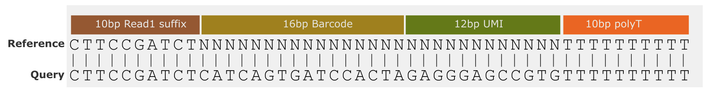

# Single cell workflow

Identification of cell- and UMI barcodes from single-cell sequencing.


## Introduction

This workflow extracts cell barcodes and UMIs from [10x](https://www.10xgenomics.com/)-generated single cell libraries.
It was initially created as a Nextflow port of [Sockeye](https://github.com/nanoporetech/sockeye).

In brief, the workflow does the following:

+ Adapter identification, fused read splitting and stranding.
+ Mapping of reads to genomic reference.
+ Gene and transcript read assignment.
+ Cell barcode and UMI extraction and correction.
+ Generation of gene and transcript count matrices for unique UMIs.
+ Tagging BAM files with cell barcodes and UMIs.
+ Calculation of library saturation.

This workflow supports the following 10x kits:
+ 3': v2/v3 and v4 (GEM-X)
+ 5': v1/v2
+ multiome (gene expression only): v1 
+ visium spatial transcriptomics: v1


The [BLAZE](https://github.com/shimlab/BLAZE) preprint provided useful benchmarking of the original sockeye implementation. 
This assisted in the selection of appropriate thresholds for cell cut-off and for defining the limits of the gene x cell matrix.

The isoform selection procedure used in this workflow was adapted from that found in the [FLAMES](https://github.com/LuyiTian/FLAMES) 
package.


## Compute requirements

Recommended requirements:

+ CPUs = 64
+ Memory = 256GB

Minimum requirements:

+ CPUs = 8
+ Memory = 32GB

Approximate run time: Approximately 8h for 120M reads with the recommended requirements.

ARM processor support: False


## Install and run


These are instructions to install and run the workflow on command line.
You can also access the workflow via the
[EPI2ME Desktop application](https://labs.epi2me.io/downloads/).

The workflow uses [Nextflow](https://www.nextflow.io/) to manage
compute and software resources,
therefore Nextflow will need to be
installed before attempting to run the workflow.

The workflow can currently be run using either
[Docker](https://www.docker.com/products/docker-desktop)
or [Singularity](https://docs.sylabs.io/guides/3.0/user-guide/index.html)
to provide isolation of the required software.
Both methods are automated out-of-the-box provided
either Docker or Singularity is installed.
This is controlled by the
[`-profile`](https://www.nextflow.io/docs/latest/config.html#config-profiles)
parameter as exemplified below.

It is not required to clone or download the git repository
in order to run the workflow.
More information on running EPI2ME workflows can
be found on our [website](https://labs.epi2me.io/wfindex).

The following command can be used to obtain the workflow.
This will pull the repository in to the assets folder of
Nextflow and provide a list of all parameters
available for the workflow as well as an example command:

```
nextflow run epi2me-labs/wf-single-cell --help
```
To update a workflow to the latest version on the command line use
the following command:
```
nextflow pull epi2me-labs/wf-single-cell
```

A demo dataset is provided for testing of the workflow.
It can be downloaded and unpacked using the following commands:
```
wget https://ont-exd-int-s3-euwst1-epi2me-labs.s3.amazonaws.com/wf-single-cell/wf-single-cell-demo.tar.gz
tar -xzvf wf-single-cell-demo.tar.gz
```
The workflow can then be run with the downloaded demo data using:
```
nextflow run epi2me-labs/wf-single-cell \
	--expected_cells 100 \
	--fastq 'wf-single-cell-demo/chr17.fq.gz' \
	--kit '3prime:v3' \
	--ref_genome_dir 'wf-single-cell-demo' \
	--genes_of_interest 'wf-single-cell-demo/umap_plot_genes.csv' \
	-profile standard
```

For further information about running a workflow on
the command line see https://labs.epi2me.io/wfquickstart/


## Related protocols

<!---Hyperlinks to any related protocols that are directly related to this workflow, check the community for any such protocols.--->

This workflow is designed to take input sequences that have been produced from [Oxford Nanopore Technologies](https://nanoporetech.com/) devices.

Find related protocols in the [Nanopore community](https://community.nanoporetech.com/docs/).

+ [Library prep and sequencing protocol for the 10x 5' kit](https://community.nanoporetech.com/docs/prepare/library_prep_protocols/ligation-sequencing-v14-single-cell-transcriptomics-with-5-cdna/v/sst_9204_v114_revd_06mar2024)
+ [Library prep and sequencing protocol for the 10x 3' kit](https://community.nanoporetech.com/docs/prepare/library_prep_protocols/single-cell-transcriptomics-with-cdna-prepared-using-10x/v/sst_9198_v114_reve_06dec2023)


## Input example

<!---Example of input directory structure, delete and edit as appropriate per workflow.--->
This workflow accepts either FASTQ or BAM files as input.

The FASTQ or BAM input parameters for this workflow accept one of three cases: (i) the path to a single FASTQ or BAM file; (ii) the path to a top-level directory containing FASTQ or BAM files; (iii) the path to a directory containing one level of sub-directories which in turn contain FASTQ or BAM files. In the first and second cases (i and ii), a sample name can be supplied with `--sample`. In the last case (iii), the data is assumed to be multiplexed with the names of the sub-directories as barcodes. In this case, a sample sheet can be provided with `--sample_sheet`.

```
(i)                     (ii)                 (iii)    
input_reads.fastq   ─── input_directory  ─── input_directory
                        ├── reads0.fastq     ├── barcode01
                        └── reads1.fastq     │   ├── reads0.fastq
                                             │   └── reads1.fastq
                                             ├── barcode02
                                             │   ├── reads0.fastq
                                             │   ├── reads1.fastq
                                             │   └── reads2.fastq
                                             └── barcode03
                                              └── reads0.fastq
```


## Input parameters

### Input Options

| Nextflow parameter name  | Type | Description | Help | Default |
|--------------------------|------|-------------|------|---------|
| fastq | string | FASTQ files to use in the analysis. | This accepts one of three cases: (i) the path to a single FASTQ file; (ii) the path to a top-level directory containing FASTQ files; (iii) the path to a directory containing one level of sub-directories which in turn contain FASTQ files. In the first and second case, a sample name can be supplied with `--sample`. In the last case, the data is assumed to be multiplexed with the names of the sub-directories as barcodes. In this case, a sample sheet can be provided with `--sample_sheet`. |  |
| bam | string | BAM or unaligned BAM (uBAM) files to use in the analysis. | This accepts one of three cases: (i) the path to a single BAM file; (ii) the path to a top-level directory containing BAM files; (iii) the path to a directory containing one level of sub-directories which in turn contain BAM files. In the first and second case, a sample name can be supplied with `--sample`. In the last case, the data is assumed to be multiplexed with the names of the sub-directories as barcodes. In this case, a sample sheet can be provided with `--sample_sheet`. |  |
| ref_genome_dir | string | The path to the 10x reference directory | Human reference data can be downloaded from 10x [here](https://cf.10xgenomics.com/supp/cell-exp/refdata-gex-GRCh38-2020-A.tar.gz). Instructions for preparing reference data can be found [here](https://www.10xgenomics.com/support/software/cell-ranger/tutorials/cr-tutorial-mr#overview) |  |
| kit | string | The 10x kit and version separated by a colon (eg: 3prime:v3) | 10x kits can be released with different versions, each requiring a specific whitelist that is looked-up by the workflow. If `single_cell_sample_sheet` is not defined, the 10x kit is applied to all samples. This parameter is ignored if `single_cell_sample_sheet` is supplied. |  |
| expected_cells | integer | Number of expected cells in the sample. | The number of expected cells. If `single_cell_sample_sheet` is not defined, `expected_cells` is applied to all samples. This parameter is ignored if `single_cell_sample_sheet` is supplied. |  |
| single_cell_sample_sheet | string | An optional CSV file used to assign library metadata per sample. If all samples have the same library metadata, this can be supplied instead by using the `--kit` and `--expected_cells` parameters. | Columns should be: [sample_id, kit, exp_cells]. This must not be confused with the MinKNOW sample_sheet. `sample_id` should correspond to `sample_name` which is defined either in the `sample_sheet`, given by the `sample` parameter (for single sample runs) or if no `sample_sheet` or `sample` is given, is derived from the folder name containing the FASTQ files. |  |
| full_length_only | boolean | Only process full length reads. | If set to true, only process reads or subreads that are classified as full length (read segments flanked by compatible adapters in the expected orientation). | True |
| min_read_qual | number | Specify read quality lower limit. | Any reads with a quality lower than this limit will not be included in the analysis. |  |


### Sample Options

| Nextflow parameter name  | Type | Description | Help | Default |
|--------------------------|------|-------------|------|---------|
| sample_sheet | string | A CSV file used to map barcodes to sample aliases. The sample sheet can be provided when the input data is a directory containing sub-directories with FASTQ files. | The sample sheet is a CSV file with, minimally, columns named `barcode` and `alias`. Extra columns are allowed. A `type` column is required for certain workflows and should have the following values; `test_sample`, `positive_control`, `negative_control`, `no_template_control`. |  |
| sample | string | A single sample name for non-multiplexed data. Permissible if passing a single .fastq(.gz) file or directory of .fastq(.gz) files. |  |  |


### Output Options

| Nextflow parameter name  | Type | Description | Help | Default |
|--------------------------|------|-------------|------|---------|
| out_dir | string | Directory for output of all workflow results. |  | output |


### Advanced options

| Nextflow parameter name  | Type | Description | Help | Default |
|--------------------------|------|-------------|------|---------|
| kit_config | string | A file defining the configurations associated with the various supported 10x kits. | A CSV file is expected with the following headers [kit, barcode_length, umi_length]. If not specified, a default `kit_configs.csv` (found in the project directory root) will be used. This parameter does not typically need be changed. |  |
| threads | integer | Number of CPU threads to use in resource intensive processes. | The total CPU resource used by the workflow is constrained by the executor configuration. | 8 |
| fastq_chunk | integer | Sets the maximum number of reads per chunk for the initial processing of reads. | Controls batching of reads for processing. | 1000000 |
| barcode_adapter1_suff_length | integer | Suffix length of the read1 adapter to use in creating the probe sequence for identifying barcode/UMI bases. | For example, specifying 12 would mean that the last 12 bases of the specified read1 sequence will be included in the probe sequence. | 10 |
| barcode_min_quality | integer | Minimum allowed nucleotide-level quality score in the extracted/uncorrected barcode sequence. | Values equal or higher to this this will be considered 'high-quality' and used for generating the barcode whitelist. | 15 |
| barcode_max_ed | integer | Maximum allowable edit distance between uncorrected barcode and the best matching corrected barcode from the sample whitelist. | Barcodes are corrected by searching from a list of barcodes known to exist in the dataset. A maximum edit distance of 2 between query and whitelist barcode is recommended. | 2 |
| barcode_min_ed_diff | integer | Minimum allowable edit distance difference between whitelist barcode candidates. | If there is more than one candidate barcode found in the whitelist, the edit distance difference of the top hit and second best hits (in relation to the uncorrected barcode) must be at least this value to be able to assign a barcode. If the edit distance difference is less than this, it is assumed that barcode identity is amiguous, and the read is not tagged with a corrected barcode. | 2 |
| gene_assigns_minqv | integer | Minimum MAPQ score allowed for a read to be assigned to a gene. |  | 30 |
| matrix_min_genes | integer | Filter cells from the gene expression matrix if they contain fewer than <matrix_min_genes> genes. |  | 200 |
| matrix_min_cells | integer | Filter genes from the gene expression matrix that are observed in fewer than <matrix_min_cells> cells. |  | 3 |
| matrix_max_mito | integer | Filter cells from the gene expression matrix if more than <matrix_max_mito> percent of UMI counts come from mitochondrial genes. |  | 20 |
| matrix_norm_count | integer | Normalize expression matrix to <matrix_norm_count> counts per cell. |  | 10000 |
| genes_of_interest | string | File containing a list of gene symbols (one symbol per line) to annotate with expression values in the UMAP projections. If doing visium spatial analysis, these genes will be used to annotate the spatial plots.  |  |  |
| mito_prefix | string | Gene name prefix to identify for mitochondrial genes. | Parts of the workflow analyse mitochondrial genes separately. These genes are identified by searching for a gene name prefix. Human mitochondrial genes can be identified with prefix 'MT-' and mouse genes with prefix 'mt-'. If the reference genome contains data from multiple organisms with different nomenclature, multiple prefixes can be supplied like so: 'MT-,mt-' | MT- |
| umap_n_repeats | integer | Number of UMAP projection to repeat for each dataset. | The UMAP algorithm contains elements of randomness that can mislead users into seeing associations between cells that are not meaningful. It is recommended to view multiple plots generated with the same parameters and check that any observed structure is consistent across runs. | 3 |
| stringtie_opts | string | StringTie options for transcriptome assembly. | StringTie option string can be supplied at the command line as in this example: `--stringtie_opts="-c 5 -m 100 "`. StringTie options can be found here: http://ccb.jhu.edu/software/stringtie/index.shtml?t=manual. The default option (-c 2) ensures that only transcripts with a coverage of 2 or higher are included in the generated transcriptome | -c 2 |


## Outputs

Output files may be aggregated including information for all samples or provided per sample. Per-sample files will be prefixed with respective aliases and represented below as {{ alias }}.

| Title | File path | Description | Per sample or aggregated |
|-------|-----------|-------------|--------------------------|
| workflow report | wf-single-cell-report.html | Report for all samples | aggregated |
| Results summaries | {{ alias }}/{{ alias }}.config_stats.json | Results summaries including adapter configuration numbers. | per-sample |
| Gene expression counts | {{ alias }}/{{ alias }}.gene_raw_feature_bc_matrix/matrix.mtx.gz | Gene x cell expression sparse matrix values (MEX format). | per-sample |
| Gene expression barcodes | {{ alias }}/{{ alias }}.gene_raw_feature_bc_matrix/barcodes.tsv.gz | Barcode column names (MEX format). | per-sample |
| Gene expression features | {{ alias }}/{{ alias }}.gene_raw_feature_bc_matrix/features.tsv.gz | Feature row names (MEX format). | per-sample |
| Transcript expression counts | {{ alias }}/{{ alias }}.transcript_raw_feature_bc_matrix/matrix.mtx.gz | Transcript x cell expression sparse matrix values (MEX format). | per-sample |
| Transcript expression MEX barcodes | {{ alias }}/{{ alias }}.transcript_raw_feature_bc_matrix/barcodes.tsv.gz | Barcode column names (MEX format). | per-sample |
| Transcript expression MEX features | {{ alias }}/{{ alias }}.transcript_raw_feature_bc_matrix/features.tsv.gz | Feature row names (MEX format). | per-sample |
| Processed gene expression counts | {{ alias }}/{{ alias }}.gene_processed_feature_bc_matrix/matrix.mtx.gz | Filtered and normalized gene x cell expression sparse matrix values (MEX format). | per-sample |
| Processed gene expression barcodes | {{ alias }}/{{ alias }}.gene_processed_feature_bc_matrix/barcodes.tsv.gz | Barcode column names (MEX format) for processed matrix. | per-sample |
| Processed gene expression features | {{ alias }}/{{ alias }}.gene_processed_feature_bc_matrix/features.tsv.gz | Feature row names (MEX format) for processed matrix. | per-sample |
| Processed transcript expression counts | {{ alias }}/{{ alias }}.transcript_processed_feature_bc_matrix/matrix.mtx.gz | Filtered and normalized transcript x cell expression sparse matrix values (MEX format). | per-sample |
| Processed transcript expression MEX barcodes | {{ alias }}/{{ alias }}.transcript_processed_feature_bc_matrix/barcodes.tsv.gz | Barcode column names (MEX format) for processed matrix. | per-sample |
| Processed transcript expression MEX features | {{ alias }}/{{ alias }}.transcript_processed_feature_bc_matrix/features.tsv.gz | Feature row names (MEX format) for processed matrix. | per-sample |
| Mitochondrial expression levels | {{ alias }}/{{ alias }}.gene_expression_mito_per_cell.tsv | Per cell mitochondrial gene expression as percentage total of total gene expression. | per-sample |
| Read summary | {{ alias }}/{{ alias }}.read_summary.tsv | Per read assigned barcodes UMIs genes and transcripts. | per-sample |
| Whitelist | {{ alias }}/{{ alias }}.whitelist.tsv | The barcodes found in the library that remain after filtering. | per-sample |
| Alignment output per sample | {{ alias }}/{{ alias }}.tagged.bam | Genomic alignment output file. | per-sample |
| Alignment index per sample | {{ alias }}/{{ alias }}.tagged.bam.bai | Genomic alignment index file. | per-sample |
| Transcriptome sequence | {{ alias }}/{{ alias }}.transcriptome.fa.gz | Transcriptome generated by Stringtie during transcript discovery stage | per-sample |
| Transcriptome annotation | {{ alias }}/{{ alias }}.transcriptome.gff.gz | Transcriptome annotation generated by Stringtie during transcript discovery stage | per-sample |
| Gene expression umap | {{ alias }}/{{ alias }}.gene_expression_umap_*.tsv | UMAP matrix from gene expression. Varying number of files will be present based on number of umap repeats. | per-sample |
| Transcript expression umap | {{ alias }}/{{ alias }}.transcript_expression_umap_*.tsv | UMAP matrix from transcript expression. Varying number of files will be present based on number of umap repeats. | per-sample |
| Barcode assignment summary | {{ alias }}/{{ alias }}.bc_assignment_summary.tsv | TSV file with barcode assignment summary statistics. | per-sample |


## Pipeline overview

<!---High level numbered list of main steps of the workflow and hyperlink to any tools used. If multiple workflows/different modes perhaps have subheadings and numbered steps. Use nested numbering or bullets where required.--->

The following section details the main steps of the workflow. 

### 1. Concatenates input files and generate per read stats.

The [fastcat/bamstats](https://github.com/epi2me-labs/fastcat) tool is used to concatenate multi-file samples to be processed by the workflow. It will also output per read stats including average read lengths and qualities.

### 2. Stranding and identification of full-length reads

Reads derived from a 10x Genomics library will ideally be flanked by two different adapter
sequences. These reads are more likely to represent full length mRNA molecules,
although that isn't guaranteed as some cDNAs may have been created by internal
priming or represent other cDNA synthesis artifacts. See this [10x Genomics Technical Note](https://cdn.10xgenomics.com/image/upload/v1660261286/support-documents/CG000376_TechNote_Antisense_Intronic_Reads_SingleCellGeneExpression_RevA.pdf) for more information.


This stage of the workflow assigns an adapter configuration to each read. 
This assigned configurations allows the stranding and orientating the reads. 
The following schematic shows an example read structure from 10x Genomics 3&#8242; library .

<figure>

<figcaption>Fig.1 Read structure for 10x 3prime kit reads</figcaption>
</figure>

Adapters are located within the reads using [vsearch](https://github.com/torognes/vsearch) (`Read1` and `TSO` in Fig.1 in the case of the 3prime kit).
The table below details the adapter sequences for each of the 10x Genomics kits, along with links to the relevant user guides.


| Kit      | adapter1                | adapter2                     | 10x user guide                                                                                                                              |
|----------|-------------------------|------------------------------|---------------------------------------------------------------------------------------------------------------------------------------------|
| 3&#8242; | CTACACGACGCTCTTCCGATCT  | ATGTACTCTGCGTTGATACCACTGCTT  | [3' kit](https://cdn.10xgenomics.com/image/upload/v1660261285/support-documents/CG000204_ChromiumNextGEMSingleCell3_v3.1_Rev_D.pdf)         |
| multiome | CTACACGACGCTCTTCCGATCT  | ATGTACTCTGCGTTGATACCACTGCTT  | [5'  kit](https://cdn.10xgenomics.com/image/upload/v1666737555/support-documents/CG000331_ChromiumNextGEMSingleCell5-v2_UserGuide_RevE.pdf) |
| 5&#8242; | CTACACGACGCTCTTCCGATCT  | GTACTCTGCGTTGATACCACTGCTT    | [Multiome kit](https://teichlab.github.io/scg_lib_structs/data/CG000338_ChromiumNextGEM_Multiome_ATAC_GEX_User_Guide_RevB.pdf)              |
| Visium   | CTACACGACGCTCTTCCGATCT  | ATGTACTCTGCGTTGATACCACTGCTT  | [Visium kit](https://cdn.10xgenomics.com/image/upload/v1695417753/support-documents/CG000239_VisiumSpatialGeneExpression_UserGuide_RevG.pdf) |

Concatenated reads are identified by adapter configuration and are split into individual subreads and 
reorientated if required.
The following table details the various configurations and the actions taken for each.


| configuration   | action                                                    |
|-----------------|-----------------------------------------------------------|
| Full length     | Reads are trimmed from each side and oriented and adapter2 is removed           |
| Single adapter1 | Reads are oriented and trimmed from adapter1 end only     |
| Single adapter2 | Reads are oriented and trimmed from the adapter2 end only |
| double adapter1 | Reads are trimmed from both sides                         |
| double adapter2 | Reads are trimmed from both sides                         |
| other           | No valid adapters found; not used in further analysis     | 

Adapter configuration summaries can be found in the output file  `{{ alias }}/{{ alias }}.config_stats.json"`

To only process full length reads the option `--full_length_only` should be set to true (default: true). 
If set to false, reads with only a single adapter or other non-full-length adapter configurations will also be processed.


### 3. Extract cell barcodes and UMIs
The next step is to extract 10x Genomics barcodes and UMI sequences from the stranded and trimmed reads.

In order to do this, the first 100bp of each read are aligned to a reference probe using [parasail](https://github.com/jeffdaily/parasail). This probe contains a suffix of the adapter1 sequence, some ambiguities ("Ns") representing the barcode and UMI, and a polyT tract.

<figure>

<figcaption>Fig.2 Schematic of a 3&#8242; v3 probe aligned to the read prefix</figcaption>
</figure>

In this case, the first 16bp of the read that aligns to the N probe region is where the barcode is expected to be, so
this sequence is assigned as `uncorrected barcode`.
The following 12 bp are where the UMI is expected, and is assigned to `uncorrected umi`.

The probe sequence will vary depending on the size of the expected barcode and UMI, which can be found in the 
following table.

| kit      |version|barcode length| UMI length |
|----------|---|---|------------|
| 3&#8242;   |v2|16| 10         |
| 3&#8242;   |v3|16| 12         |
| 5&#8242;   |v1|16| 10         |
| multiome |v1|16| 12         |

Workflow options:
- The size of the adapter1 suffix can be specified with: `barcode_adapter1_suff_length`

Once the barcode and UMI has been extracted, these are then trimmed from the reads along
with the adapter1 sequence. These trimmed reads are then used in the alignment step.

### 4. Aligning reads to genome
The next stage is to align the preprocessed reads to the reference genome. This enables gene and transcript
read assignment in downstream steps.

The stranded and trimmed FASTQ reads are mapped to the reference genome using minimap2.  
The parameter `resources_mm2_max_threads int` controls the threads given to an alignment process.
Other optional parameters can be supplied to minimap2 using `resources_mm2_flags` (for example `--resources_mm2_flags="-I 16GB"`).


### 5. Barcode correction
The aim of this stage is to correct errors present in the previously extracted barcodes.
10x Genomics barcodes are not random; all possible barcode sequences can be found in a whitelist of known barcodes. 
The appropriate whitelist for each kit and version is chosen automatically by the workflow.
The whitelist is used to generate a shortlist of high quality barcodes present in the sample, which is then used to 
correct barcode errors.

The correction proceeds as follows:
* A shortlist of all high quality barcodes present in our sample is generated. 
This is done by adding an uncorrected barcode to the shortlist if it:
  * has a min quality > `barcode_min_quality` (default 15)

In each cell library there are expected to be some low quality cells and empty droplets that can be identified by their low number of reads.
To remove these cells, the shortlist is filtered with a quantile based threshold.
This threshold is determined by ranking the cells by read count and taking the top n cells (n = `expected_cells`).
The read count 95th percentile / 20 is the threshold used. This threshold can be visualised in the knee plots generated by the workflow.

*note*: As `visium` barcodes do not represent cells, but rather tissue coordinates,
shortlist cell count thresholding is not performed for `visium` analysis.

For uncorrected barcodes not present in the shortlist, they are cross-referenced against the shortlist, and are assigned 
a barcode from this list if the candidate barcode meets the following criteria:
* the query and closest-matched shortlist barcode have an edit distance <= 2
* The edit distance difference between the top and hit and second top hit in the shortlist >= 2

*note*: Edit distance here refers specifically to the Levenshtein distance, which is the minimum number of single base 
changes it would take to transform one UMI into another (including insertions, substitutions or deletions).

Workflow options:
* `barcode_max_ed`: Max edit distance between the uncorrected barcode and the matching whitelist barcode (default 2).
* `barcode_min_ed_diff`: Min difference in edit distance between (1) the uncorrected barcode vs top hit and (2) uncorrected barcode vs runner-up hit (default 2).
* `expected_cells`: Number of expected cells. Enter the number of expected cells in the sample.


### 6. Gene and transcript assignment
Now that barcodes and UMIs have been assigned, the next stage is to assign a gene and transcript to each read. 

The first step is to create a transcriptome using stringtie2 (using long read mode `-L`).
The minimum required transcripts for a transcript to be called is 2. This can be changed, along with other stringtie settings using the 
`stringtie_opts` options (default "-c 2"). The resulting query transcriptome is then annotated with the supplied reference 
genome annotation using [gffcompare](https://ccb.jhu.edu/software/stringtie/gffcompare.shtml), annotating query transcripts with reference transcript and gene metadata.

The original reads are then mapped to this transcriptome, producing one or more alignments per read.

#### Transcript assignment
To assign a read to a transcript, we follow a similar procedure to that used by [FLAMES](https://github.com/LuyiTian/FLAMES).
* Transcripts that map to intronic query transcripts (those mapping to query transcripts with gffcompare classes ['i', 'y', 'p', 's'])
are set to unknown (-). This does not affect the gene assignment.
* Any read that uniquely maps to the annotated transcriptome is assigned that transcript.
* Any read that does not uniquely map to a transcript is processed with the following procedure:
  * Order alignments by alignment score (AS)
  * If the top alignment has a better AS or query coverage than the second, and
  has a minimum transcript coverage of 0.4, assign to this transcript, else set as unknown (-)
  * If the AS is the same between the 1st and 2nd alignment the choose the alignment that has the highest transcript coverage, if the coverage is > 0.8 

#### Gene assignment
For each read, the alignment with the highest genomic MAPQ score is used for gene assignemnt if this score > `gene_assigns_minqv` (default 30).
The gene ID is then derived from the transcript assigned in the transcript assignment step.

### 7. UMI correction 
The next step is to correct UMI errors. The previous barcode correction step leveraged a
whitelist of all potential barcodes, drastically narrowing the search space. However, UMIs are random sequences and so there is no way of knowing beforehand
which UMIs will be in our library. To reduce the UMI search space, the reads are initially clustered by assigned gene, or if
no gene is assigned, by genomic interval. This also has the effect of reducing the likelihood of UMI collisions which occur due to the number
of total reads in a library usually being significantly higher than the total possible number of UMIS (16.7 million combinations for a 12bp UMI).

UMI clusters are then generated from these gene-clustered reads using [UMI-tools](https://github.com/CGATOxford/UMI-tools) with 
a slightly modified version of the [directional method](https://umi-tools.readthedocs.io/en/latest/the_methods.html).
For this clustering, Levenshtein distance threshold is used (default 2) instead of Hamming distance, in order to account for UMI indels. 
The selected node of each cluster is the one with the highest number of reads and is used to assign a `corrected_umi` to the rest of the reads in that cluster.

### 8. Make expression matrices
The gene x cell and transcript x cell expression matrices are the main outputs of the workflow and can be used in further analysis of 
the single cell experiment. 

The expression matrices are generated by collapsing the corrected UMIs (counting each unique UMI once) and summing
the counts of features (gene or transcript) per cell to give a feature x cell expression matrix and are output as a folder of files in  Market Exchange (MEX) 
format (see the [output docs](docs/outputs.md)  

The expression count matrices are further processed in the following way to give gene x cell processed matrices 
and are also output in  Market Exchange (MEX) format.
* Cells are dropped that contain less than `matrix_min_genes` genes or transcripts (default 200)
* Genes are dropped which are present in fewer than `matrix_min_cells` (default 3)
* Cells where mitochondrial genes make up more than `matrix_max_mito` (default 20%) are dropped
* Counts are normalized to `matrix_norm_count` (default 10,000) reads/cell
* Normalized counts are finally log10 transformed


### 9. Tagging bam files
BAM files generated from aligning reads to the reference genome are now tagged with the 
following information from the workflow. By default, the BAMs are output per chromosome, but can be concatenated
into a single file per sampe using `merge_bam`. The new bam will contain the following tags:
  - CB: corrected cell barcode sequence
  - CR: uncorrected cell barcode sequence
  - CY: Phred quality scores of the uncorrected cell barcode sequence
  - UB: corrected UMI sequence
  - UR: uncorrected UMI sequence
  - UY: Phred quality scores of the uncorrected UMI sequence


### 10. Calculate library saturation
Sequencing saturation is an estimate of the library complexity that has been captured in a sequencing run.
As read depth per cell increases, the number of genes and distinct UMIs identified will increase at a rate that is 
dependent on the complexity of the input library. 

Reads which have been assigned a corrected barcode, corrected UMI and gene
are subsampled by varying degrees and the resulting median reads/cell is plotted against either:
- median genes per cell: this gives an indication of the gene complexity captured and whether increasing read depth would lead 
 to significantly more genes being identified.
- median UMIs per cell: this gives an indication of the UMI complexity captured. If this plot plateaus out, it may indicate that 
    PCR duplicates represent a high proportion of the reads at higher sequencing depth.
- Sequencing saturation:  calculated as `1 - (number of unique UMIs across all cells / number of reads across all cells)`. Values near 0 indicate that
 very few duplicate UMIs are being identified, whereas values nearer to 1 indicate a higher proportion of duplicate UMIs are being captured.
    1 / (1 - sequencing saturation) can be used can be used to estimate how many additional reads would be required to identify a new UMI. For example, if the sequencing saturation is 0.5 
    (50%) then for each two new reads, one of those should represent a new UMI. If the sequencing saturation is lower, at 0.2
    for example, then on average 1.25 reads would need to be sequenced to obtain a new UMI.


### 11. Make UMAP plots
UMAP (Uniform Manifold Approximation and Projection) is a data visualisation algorithm used
for dimensionality reduction. It aims to preserve the local structure and relationships in high-dimensional data (in this case a gene x cell count matrix)
when projecting it into a two-dimensional space. This allows structure within the data, such as cell type and state, to be visualised, 
and can be useful for quality control and gaining an initial view of the data.  To generate UMAP plots use `plot_umaps`. The data used for the 
UMAP generation are the [processed expression matrices](#Make-expression-matrices)


Several UMAP plots are created:
- gene expression plots show the gene expression UMAPs with each cell annotated with the mean gene expression count
- mitochondrial expression plots are the same but annotated with mean mitochondrial expression
- single gene expression UMAPs again show the gene expression UMAPs, but each plot is overlaid with a gene count data from a single gene. 
 These genes of interest can be specified by adding gene names to a file with the path spcified by `umap_plot_genes path/to/gene+names.csv`
- transcript expression plots shows the transcript expression UMAP plots with each cell annotated with the mean gene transcript count per cell

The UMAP algorithm is stochastic, therefore analysing the same data multiple times, using identical parameters, can lead to visually different projections. 
In order to have some confidence in the observed results, it can be useful to run the projection multiple times.
The number of repeated projections can be set with `umap_n_repeats` (default 3)


## Troubleshooting

<!---Any additional tips.--->
+ If the workflow fails please run it with the demo data set to ensure the workflow itself is working. This will help us determine if the issue is related to the environment, input parameters or a bug.
+ See how to interpret some common nextflow exit codes [here](https://labs.epi2me.io/trouble-shooting/).

When using singularity the following error may occur:

```
RuntimeError: cannot cache function 'rdist': no locator available for file '/home/epi2melabs/...'
```

If you receive this error, you may need to set the numba cache directory to a location that is writable by the singularity 
container. To do this, add the following contents to a file (`numba.config` for example) and use `-c numba.config` in the workflow command
to apply it.

```
profiles {
    singularity {
        singularity {
            enabled = true
            autoMounts = true
            runOptions = '--writable-tmpfs'
        }
    }
}
env {
    NUMBA_CACHE_DIR = "${launchDir}/numba_cache"
}
```


## FAQ's

<!---Frequently asked questions, pose any known limitations as FAQ's.--->

If your question is not answered here, please report any issues or suggestions on the [github issues](https://github.com/epi2me-labs/wf-single-cell/issues) page or start a discussion on the [community](https://community.nanoporetech.com/).


## Related blog posts

<!---Any other sections that are relevant specifically to this workflow and may be useful to users eg. ## Related blog posts. ## Learning center links.--->

## Related blog posts

See the [EPI2ME website](https://labs.epi2me.io/) for lots of other resources and blog posts.


